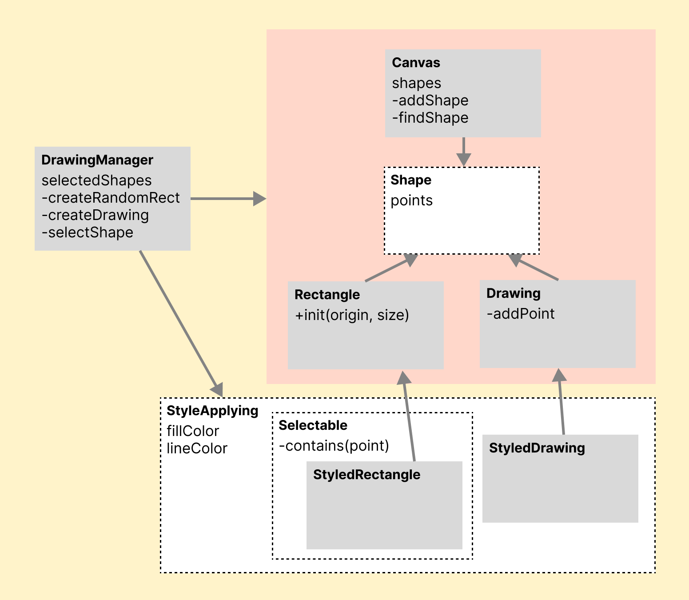

# swift-drawingapp
## Step 1

### Model

- 빨간색 영역은 오직 좌표에 대한 내용만 처리한다.
- 노란색 영역은 도형의 스타일 및 앱의 기능을 추가한다.

### View / ViewModel

#### Shape ViewModel 및 View

- Shape를 UIView로 표현하며 출력 기능만 담당.

#### Canvas ViewModel 및 View

- Canvas를 UIView로 표현하며 출력기능만 담당.

- 뷰모델에서 Point를 CGPoint로 상호 변환한다.

#### DrawingManager ViewModel 및 View

- 뷰에선 Canvas 뷰를 가지고 있고 뷰모델에선 Canvas 뷰모델을 갖고 있다.
- 입력을 DrawingManager로 전달하며 Canvas 뷰/뷰모델을 사용하여 출력한다.
